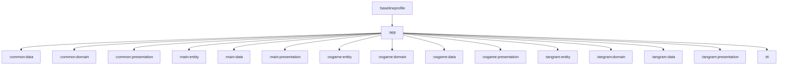
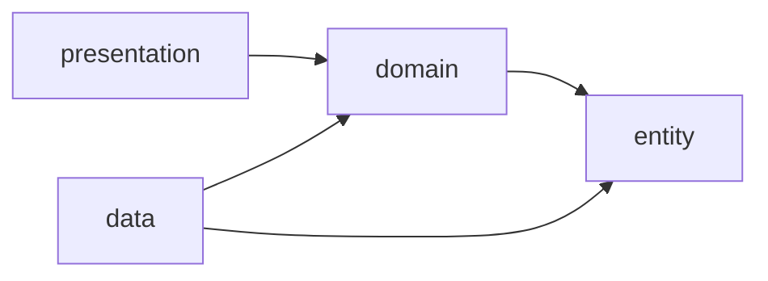
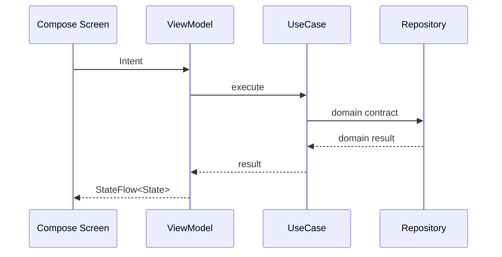
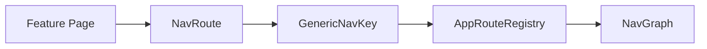

# JJongle Android

쫑글은 아이들이 퀴즈와 퍼즐을 통해 동물 콘텐츠를 경험하는 Android 애플리케이션입니다. 

이 README는 프로젝트 전체 구조와 핵심 설계 포인트를 빠르게 이해할 수 있도록 아키텍처를 정리합니다.

## 주요 기능

- Google/Firebase 기반 로그인, 회원가입, 프로필 관리
- 지도 화면과 동물 도감 중심의 메인 앱 셸
- OX 퀴즈 게임, 얼굴 위치 판별, 오답 노트/히스토리 관리
- 칠교놀이 퍼즐 스테이지와 히스토리 조회
- 전역 메시지 효과, 디자인 토큰, 반응형 레이아웃
- TTI, JankStats, Baseline Profile 기반 성능 관찰 지점

## 기술 스택

| 영역 | 사용 기술 |
|---|---|
| Language | Kotlin 2.0 |
| UI | Jetpack Compose, Material3 |
| Architecture | Multi-module, Clean Architecture, MVI |
| DI | Hilt |
| Navigation | AndroidX Navigation3 runtime, typed route model |
| Async | Kotlin Coroutines, Flow |
| Network | Retrofit, OkHttp, kotlinx.serialization |
| Auth/Data | Firebase Auth, Firestore, Room |
| Performance | JankStats, Macrobenchmark, Baseline Profile, custom TTI helper |
| Test | JUnit, kotlinx-coroutines-test, Paparazzi, Android instrumentation compile |

## 모듈 구조

쫑글은 실행 모듈 `:app`이 공통 모듈과 기능 모듈을 조립하고, 기능 모듈은 `entity`, `domain`, `data`, `presentation` 레이어로 분리하는 방향을 따릅니다.

레이어 의존성은 아래 방향을 기본으로 합니다. `presentation`은 화면 상태와 이벤트를 담당하고, `data`는 외부 데이터 원본과 구현체를 담당하며, 둘은 `domain` 계약을 통해 만납니다.

## 디렉터리 가이드

| 경로 | 역할 |
|---|---|
| [app](app/README.md) | Android 앱 엔트리, Hilt 루트 바인딩, 앱 셸 조립 |
| [common](common/README.md) | 공통 entity/domain/data/presentation 기반 |
| [main](main/README.md) | 메인 앱 셸, 라우팅, 딥링크, 지도/도감/인증 UI |
| [oxgame](oxgame/README.md) | OX 퀴즈 게임 기능 |
| [tangram](tangram/README.md) | 탱그램 퍼즐 기능 |
| [tti](tti/README.md) | Time To Interactive 계측 헬퍼 |
| [baselineprofile](baselineprofile/README.md) | Baseline Profile 및 startup benchmark 수집 |

## 핵심 설계 포인트

### 1. 기능 단위 멀티 모듈

기능별 모듈을 `entity`, `domain`, `data`, `presentation`으로 분리해 UI, 비즈니스 계약, 데이터 구현의 변경 이유를 나눴습니다. 이 구조는 기능 추가 시 영향 범위를 좁히고, domain/entity 레이어의 JVM 테스트를 가볍게 유지하는 데 목적이 있습니다.

### 2. MVI 기반 화면 상태 관리

화면 입력은 `Intent`, 내부 상태 변경은 `ReducerEvent`, 렌더링 모델은 `State`로 분리합니다. 공통 기반은 [MviViewModel](common/presentation/src/main/kotlin/com/ssafy/jjongle/common/presentation/mvi/MviViewModel.kt)에 두고, 기능 ViewModel은 상태 흐름과 이벤트 처리에 집중합니다.

### 3. 타입 기반 Navigation3 라우팅

라우팅은 문자열을 직접 흩뿌리지 않고 `Page`, `NavRoute`, `GenericNavKey`, `AppRoute` 같은 타입으로 감쌉니다. 기능 모듈은 자신의 페이지 계약을 제공하고, 앱 셸은 레지스트리에서 이를 Compose route로 조립합니다.

### 4. DTO와 도메인 모델 경계

원격/로컬 데이터 형태는 data 레이어의 DTO/Entity에 두고, 화면과 domain 레이어는 앱 내부 모델에 의존하도록 분리했습니다. 이 방식은 서버 응답 형태나 로컬 저장소 구조가 바뀌어도 UI와 use case의 변경 범위를 줄이기 위한 선택입니다.

### 5. 전역 메시지 효과 분리

Snackbar/Dialog 같은 일회성 UI 효과는 [MessageEffectBus](common/presentation/src/main/kotlin/com/ssafy/jjongle/common/presentation/message/MessageEffectBus.kt)와 [MessageEffectHost](common/presentation/src/main/kotlin/com/ssafy/jjongle/common/presentation/message/MessageEffectHost.kt)로 분리했습니다. domain 계층은 `MessageHelper` 계약만 알고, 실제 Compose 표시는 app 루트에서 처리합니다.

### 6. 성능 관찰 지점

앱에는 세 가지 성능 관찰 지점이 있습니다.

- `:tti`: 화면별 TTI 타임라인과 메타데이터 기록
- `common:presentation`: JankStats 기반 jank frame 수집
- `:baselineprofile`: Macrobenchmark 기반 baseline profile 생성

## 실행 방법

### 요구 환경

- Android Studio
- JDK 17 또는 21
- Android SDK 36
- Firebase 설정 파일: `app/google-services.json`

## 문서 읽는 순서

1. 이 README에서 전체 구조를 확인합니다.
2. [common](common/README.md)에서 공통 기반을 확인합니다.
3. [main](main/README.md)에서 앱 셸과 Navigation 흐름을 확인합니다.
4. [oxgame](oxgame/README.md), [tangram](tangram/README.md)에서 기능 모듈 구조를 확인합니다.
5. [tti](tti/README.md), [baselineprofile](baselineprofile/README.md)에서 성능 계측 구조를 확인합니다.

## 포트폴리오 관점의 구현 포인트

- 기존 단일 모듈 앱 중심 구조를 기능 단위 멀티 모듈 구조로 분리
- Navigation3 스타일의 typed route와 앱 라우트 레지스트리 구성
- MVI ViewModel 공통 기반과 화면별 Intent/State/ReducerEvent 정리
- DTO, Room Entity, domain/entity 모델 경계 정리
- KDoc 형식을 통일해 클래스/인터페이스의 역할과 계층을 빠르게 파악할 수 있게 정리
