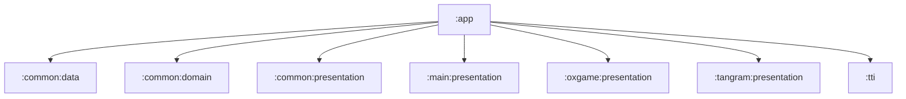

# app

Android 애플리케이션 엔트리 모듈입니다. 기능 모듈과 공통 모듈을 조립하고, Hilt 루트 바인딩과 Compose 앱 셸을 연결합니다.

## 의존성



## 주요 책임

- `MainActivity`에서 Compose 루트와 Navigation host 구성
- `AppModule`에서 전역 helper, message bus, TTI/Jank reporter 제공
- 앱 실행에 필요한 feature/data/presentation 모듈 조립
- debug/release/benchmark 빌드 타입 설정

## 주요 파일

- `src/main/java/com/ssafy/jjongle/MainActivity.kt`
- `src/main/java/com/ssafy/jjongle/JjongleApplication.kt`
- `src/main/java/com/ssafy/jjongle/di/AppModule.kt`

## 검증

```bash
./gradlew :app:compileDebugKotlin
./gradlew :app:compileDebugAndroidTestKotlin
```
