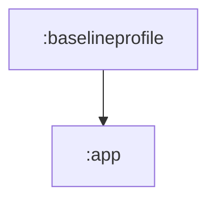

# baselineprofile

앱 시작과 주요 경로의 Baseline Profile을 수집하는 Android test 모듈입니다.

## 의존성



## 주요 책임

- Macrobenchmark 기반 startup benchmark 정의
- Baseline Profile 생성 시나리오 관리
- release/benchmark 성능 최적화 입력 데이터 수집

## 검증

```bash
./gradlew :baselineprofile:compileBenchmarkReleaseKotlin
./gradlew :baselineprofile:compileNonMinifiedReleaseKotlin
```
