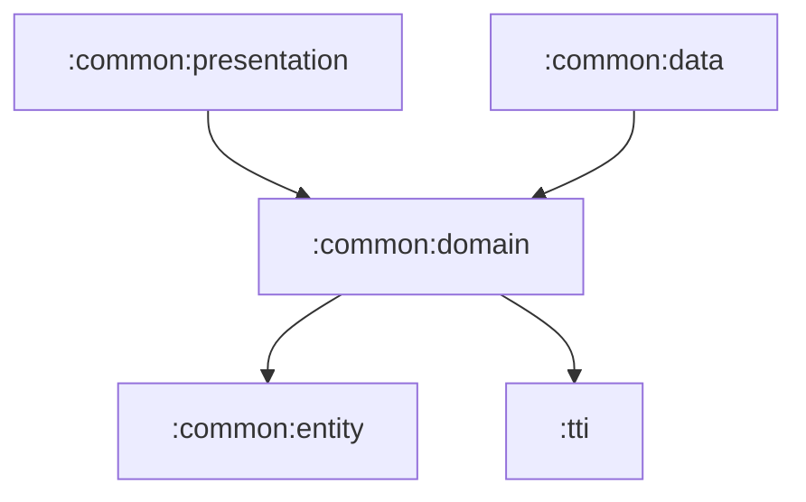

# common

여러 기능 모듈에서 함께 쓰는 공통 기반입니다. 앱 전체의 도메인 계약, 데이터 구현, presentation 유틸리티, 공통 entity를 계층별로 나눕니다.

## 의존성

## 하위 모듈

- [common:entity](entity/README.md): 앱 전역 값 모델
- [common:domain](domain/README.md): 공통 use case, repository/helper 계약
- [common:data](data/README.md): 인증, 네트워크, 로컬 설정 구현
- [common:presentation](presentation/README.md): MVI, 메시지, 디자인 시스템, 성능 UI 유틸리티
