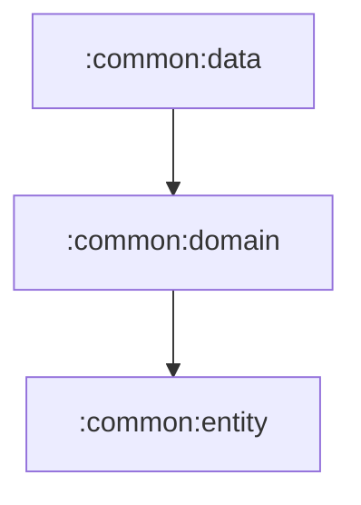

# common:data

공통 domain 계약을 실제 데이터 원본에 연결하는 Android data 모듈입니다.

## 의존성



## 주요 책임

- Firebase Auth, Firestore, Google Sign-In 연동
- Retrofit/OkHttp/kotlinx.serialization 네트워크 구성
- 공통 repository 구현체 제공
- 로컬 세션/설정 데이터 원본 관리
- Firebase BOM을 API 제약으로 노출해 소비 모듈 classpath 안정화

## 검증

```bash
./gradlew :common:data:testDebugUnitTest
```
