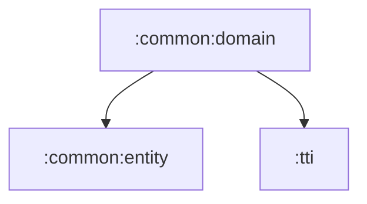

# common:domain

앱 전역 use case, repository 계약, helper 계약, 공통 오류 모델을 담는 순수 Kotlin 모듈입니다.

## 의존성



## 주요 책임

- `BaseUseCase` 기반 공통 실행 흐름 제공
- 인증, 설정, BGM, Google Auth repository 계약 정의
- Navigation/Message/Resource helper 계약 정의
- HTTP/Auth 오류 모델과 parser 제공

## 검증

```bash
./gradlew :common:domain:test
```
