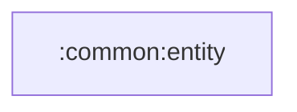

# common:entity

앱 전역에서 공유하는 순수 Kotlin 값 모델 모듈입니다.

## 의존성



## 주요 책임

- 동물 타입, 사용자 정보, 인증 상태, BGM 그룹 같은 공통 모델 제공
- Android framework 의존 없이 domain/presentation/data 계층에 값 전달

## 검증

```bash
./gradlew :common:entity:compileKotlin
```
