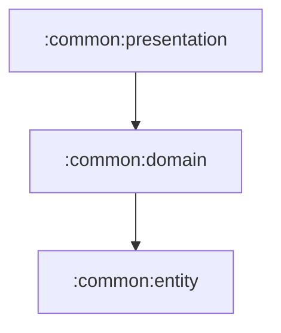

# common:presentation

여러 화면에서 공유하는 Compose presentation 기반 모듈입니다.

## 의존성



## 주요 책임

- `MviViewModel` 공통 기반 제공
- `MessageEffectBus`와 `MessageEffectHost`로 전역 Snackbar/Dialog 효과 처리
- 디자인 토큰, 공통 텍스트/버튼/레이아웃 컴포넌트 제공
- JankStats 기반 화면 성능 관찰 유틸리티 제공

## 검증

```bash
./gradlew :common:presentation:testDebugUnitTest
```
