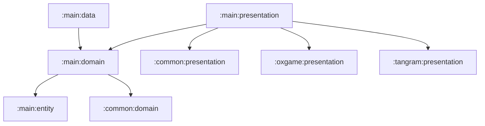

# main

메인 앱 셸과 라우팅을 담당하는 기능 그룹입니다. 지도, 인증, 마이페이지, 동물 도감, 설정 같은 앱 기본 흐름을 포함합니다.

## 의존성

## 하위 모듈

- [main:entity](entity/README.md): 메인 기능의 값 모델
- [main:domain](domain/README.md): 라우팅/딥링크 domain 계약
- [main:data](data/README.md): 메인 domain 계약 구현
- [main:presentation](presentation/README.md): 앱 셸 UI, Navigation host, 화면 ViewModel
