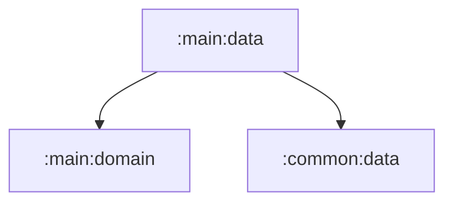

# main:data

메인 domain 계약의 data 구현 모듈입니다.

## 의존성


```mermaid
graph TD
    main_data[":main:data"] --> main_domain[":main:domain"]
    main_data --> common_data[":common:data"]
```

## 주요 책임

- Navigation state repository 구현 제공
- 앱 셸이 사용하는 상태 저장 구현을 data 계층에 격리

## 검증

```bash
./gradlew :main:data:compileDebugKotlin
```
