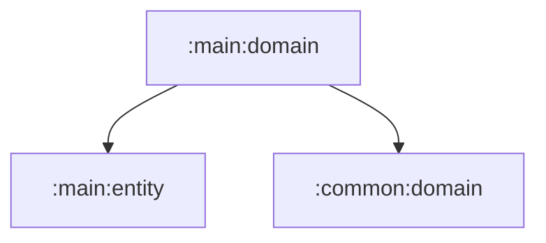

# main:domain

메인 앱 셸의 domain 계약을 담는 순수 Kotlin 모듈입니다.

## 의존성



## 주요 책임

- 딥링크 route pattern 파싱 규칙 제공
- Navigation state repository 계약 정의
- 메인 화면 page 계약 제공

## 검증

```bash
./gradlew :main:domain:test
```
