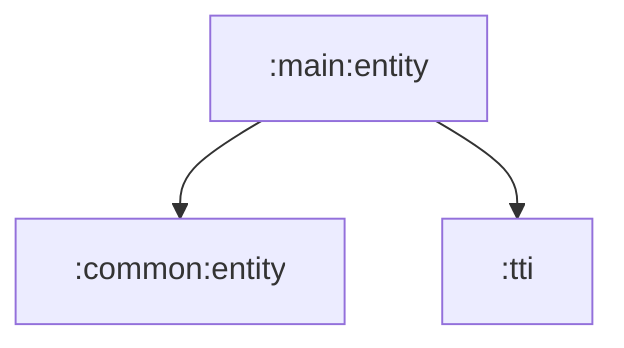

# main:entity

메인 기능에서 공유하는 값 모델 모듈입니다.

## 의존성


```mermaid
graph TD
    main_entity[":main:entity"] --> common_entity[":common:entity"]
    main_entity --> tti[":tti"]
```

## 주요 책임

- 메인 화면 TTI 페이지 모델 제공
- common entity와 성능 계측 타입을 메인 기능 문맥에 맞게 연결

## 검증

```bash
./gradlew :main:entity:compileKotlin
```
