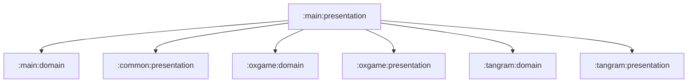

# main:presentation

앱 셸 UI와 Navigation host를 담당하는 Compose presentation 모듈입니다.

## 의존성



## 주요 책임

- `NavGraph`, `AppRouteRegistry`, `GenericNavKey` 기반 typed route 조립
- 지도, 인증, 마이페이지, 도감, 설정 등 메인 화면 구성
- 화면별 MVI Intent/State/ViewModel 관리
- 딥링크와 synthetic back stack 처리

## 검증

```bash
./gradlew :main:presentation:compileDebugKotlin
```
