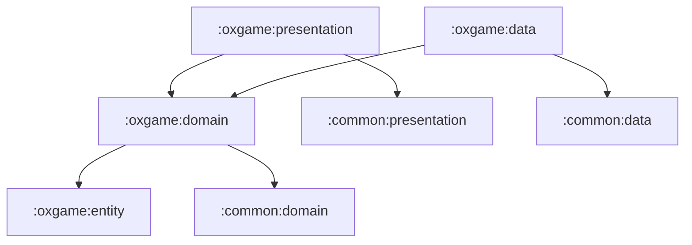

# oxgame

OX 퀴즈 게임 기능 그룹입니다. 게임 domain 로직, Room 기반 히스토리 저장, Camera/ML Kit 기반 화면 보조 로직, Compose UI를 포함합니다.

## 의존성

## 하위 모듈

- [oxgame:entity](entity/README.md): 게임 값 모델
- [oxgame:domain](domain/README.md): 게임 use case와 repository 계약
- [oxgame:data](data/README.md): 게임 엔진, Room, repository 구현
- [oxgame:presentation](presentation/README.md): 게임 화면, Camera/ML Kit 보조 로직, ViewModel
