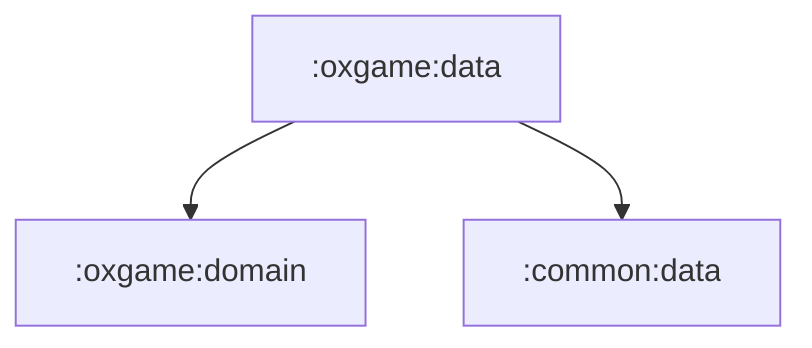

# oxgame:data

OX 게임 domain 계약의 data 구현 모듈입니다.

## 의존성



## 주요 책임

- 로컬 OX 게임 엔진 구현
- Room database, DAO, entity로 게임 히스토리와 오답 노트 저장
- domain repository 구현체 제공

## 검증

```bash
./gradlew :oxgame:data:testDebugUnitTest
```
