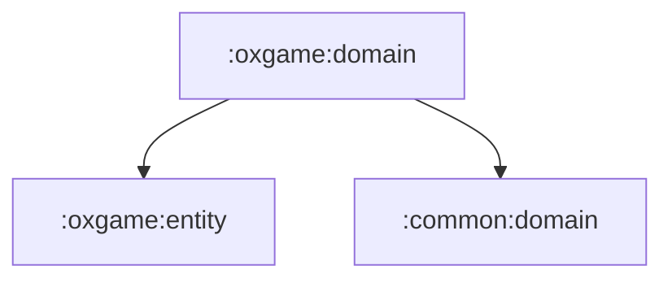

# oxgame:domain

OX 게임의 비즈니스 시나리오와 repository 계약을 담는 순수 Kotlin 모듈입니다.

## 의존성



## 주요 책임

- 게임 시작, 액션 처리, 점수 갱신, 랭킹 계산 use case 제공
- 게임 히스토리/오답 노트 repository 계약 정의
- presentation과 data 사이의 게임 규칙 경계 유지

## 검증

```bash
./gradlew :oxgame:domain:test
```
