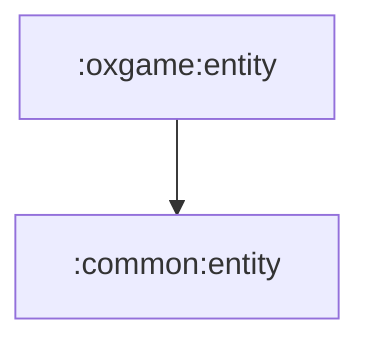

# oxgame:entity

OX 게임에서 사용하는 순수 Kotlin 값 모델 모듈입니다.

## 의존성



## 주요 책임

- 퀴즈, 점수, 게임 이벤트, 위치, 히스토리 모델 제공
- domain/data/presentation 사이에서 공유할 게임 의미를 표현

## 검증

```bash
./gradlew :oxgame:entity:compileKotlin
```
