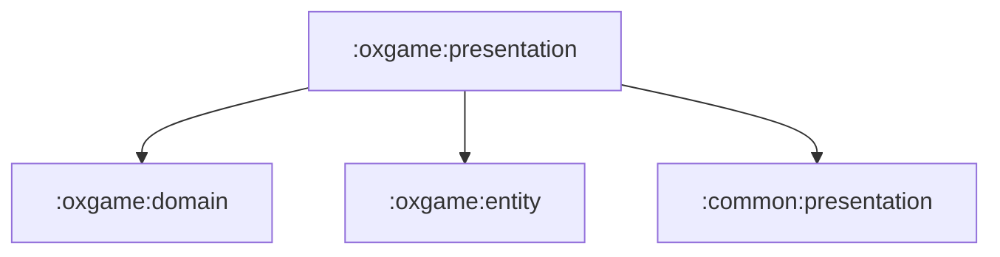

# oxgame:presentation

OX 게임 화면과 ViewModel을 담당하는 Compose presentation 모듈입니다.

## 의존성



## 주요 책임

- OX 게임 타이틀, 튜토리얼, 플레이 화면 구성
- MVI Intent/State/ReducerEvent와 ViewModel 관리
- CameraX, ML Kit face detection, 위치 분류 보조 로직 제공
- Lottie 기반 결과/상태 표현 리소스 사용

## 검증

```bash
./gradlew :oxgame:presentation:testDebugUnitTest
```
