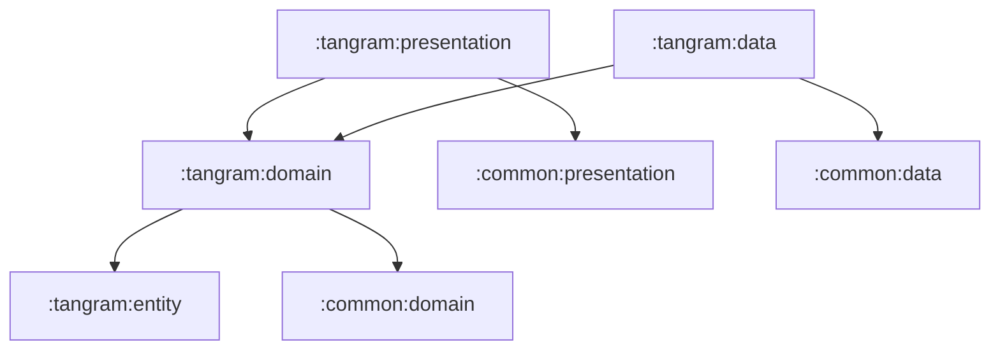

# tangram

탱그램 퍼즐 기능 그룹입니다. 탱그램 상세/히스토리 조회, 스테이지 UI, 게임 상태 관리를 포함합니다.

## 의존성

## 하위 모듈

- [tangram:entity](entity/README.md): 탱그램 값 모델
- [tangram:domain](domain/README.md): use case와 repository 계약
- [tangram:data](data/README.md): API DTO, remote data source, repository 구현
- [tangram:presentation](presentation/README.md): 탱그램 화면과 ViewModel
