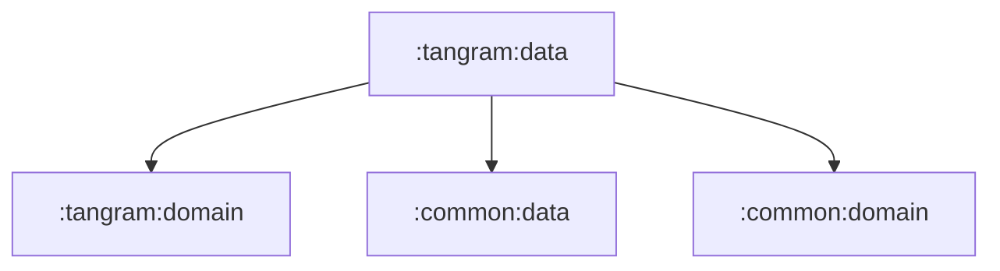

# tangram:data

탱그램 domain 계약의 data 구현 모듈입니다.

## 의존성



## 주요 책임

- 탱그램 API service와 remote data source 제공
- API DTO를 domain/entity 모델로 변환
- 탱그램 repository 구현체 제공

## 검증

```bash
./gradlew :tangram:data:testDebugUnitTest
```
