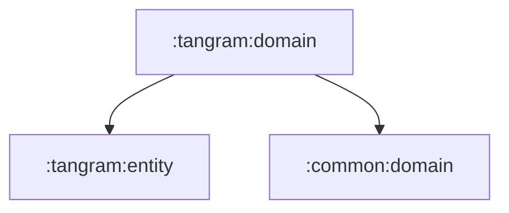

# tangram:domain

탱그램 기능의 비즈니스 계약을 담는 순수 Kotlin 모듈입니다.

## 의존성



## 주요 책임

- 탱그램 상세/히스토리 조회 use case 제공
- 탱그램 게임 진행 use case 제공
- 탱그램 repository 계약 정의

## 검증

```bash
./gradlew :tangram:domain:test
```
