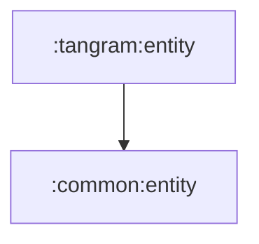

# tangram:entity

탱그램 기능에서 사용하는 순수 Kotlin 값 모델 모듈입니다.

## 의존성



## 주요 책임

- 탱그램 상세, 히스토리, 페이지 모델 제공
- domain/data/presentation 사이의 탱그램 의미 모델 공유

## 검증

```bash
./gradlew :tangram:entity:compileKotlin
```
