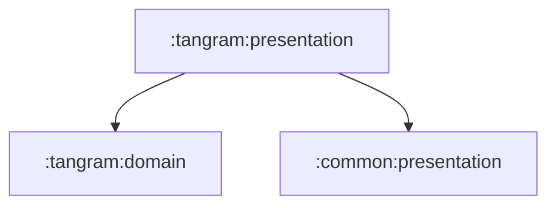

# tangram:presentation

탱그램 화면과 ViewModel을 담당하는 Compose presentation 모듈입니다.

## 의존성



## 주요 책임

- 탱그램 타이틀, 튜토리얼, 스테이지 화면 구성
- 스테이지 상태와 사용자 입력 처리
- 탱그램 ViewModel 테스트를 통한 상태 전이 검증

## 검증

```bash
./gradlew :tangram:presentation:testDebugUnitTest
```
