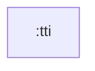

# tti

Time To Interactive 계측을 위한 순수 Kotlin 모듈입니다. Android framework 없이 화면별 TTI 타임라인과 메타데이터를 기록할 수 있게 합니다.

## 의존성



## 주요 책임

- `TTIPage`로 계측 대상 페이지 표현
- `TTIHelper`로 시작/종료/타임라인/메타데이터 기록 계약 제공
- `TTIHelperImpl`로 테스트 가능한 clock 기반 계측 구현 제공

## 검증

```bash
./gradlew :tti:test
```
